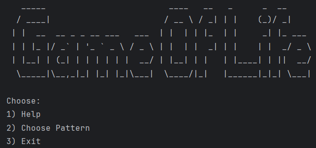

# Game Of Life

## Goal
The goal of this project was to remake Conway's game of life in Kotlin with the use of [LWJGL](https://www.lwjgl.org/)

## System Requirements
- Windows operating system
- Oracle OpenJDK 23.0.1

## Packages
### gameOfLife
- `Point`: Cell representation
- `GameOfLife`: Collection used for storing points is HashSet
- `Pattern`: Class for reading `.rle` pattern files
### input
- `KeyHandler`: Handles keyboard input
- `MouseHandler`: Handles mouse input
- `UserControllable`: If user is manipulating a class property with input, it must use this interface
### rendering 
- `Camera`: Is movable by user -> Implements UserControllable. Offsets the rendering.
- `Window`: Window that renders points as squares via [LWJGL](https://www.lwjgl.org/)

## User Guide (Uživatelská příručka)
### How to use
1) Choose a pattern in console
2) Press space to pause/unpause
3) Adjust simulation speed with `Up` and `Down` arrow keys
4) Move with W/A/S/D 
5) Zoom in and out using scroll wheel (Sometimes you need to zoom out in order to see the pattern)

### To add a pattern
1) Go to [Golly](https://golly.sourceforge.io/webapp/golly.html) website
2) Choose a pattern (Or make your own) with the default rule `B3/S23` 
3) Download it as `.rle` file
4) Add it to `src/main/resources/patterns` directory
5) Profit

## Conclusion (Závěr)
Using GLSL shaders would boost performance. 
The current bottleneck is 
the absence of a more efficient algorithm for calculating next generation.
